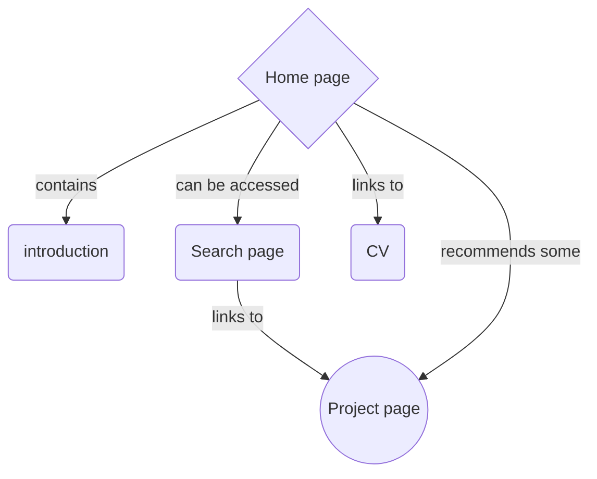

# hegedus-bernat.github.io

## Techstack

Angular application deployed to github pages. Using Angular material for styling. Should be  Translatable

## Permanent on screen element

hamburger button opening navigation.
language selection.

## Home page

1. Introduction 
        
    a brief intro to the purpose of the page

1. navigation
    
    navigation a to other parts of the page

1. Project showcases

    few project linked throught cards

1. motivation

    motivation for softwre development

## Search

Intended for search in projects (more info [here](./pageplans/search-spec.md))

## Project page

lengthy description for project. illustrated by pictures. Link for github where aplicable. tags should also be displayed somewere non intrusive.

## CV

the most up to date cv should be displayed

## Introduction

motivation for pursuing this career. brief descrtiption of career to this date.